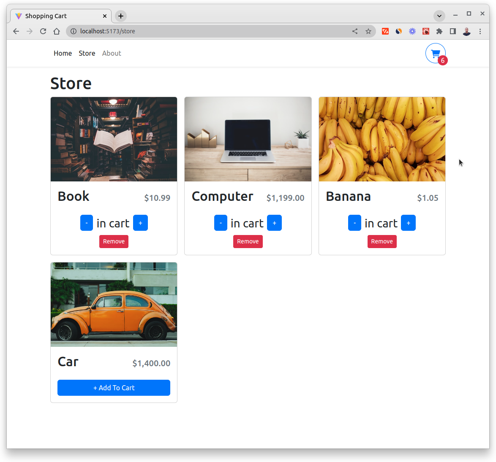
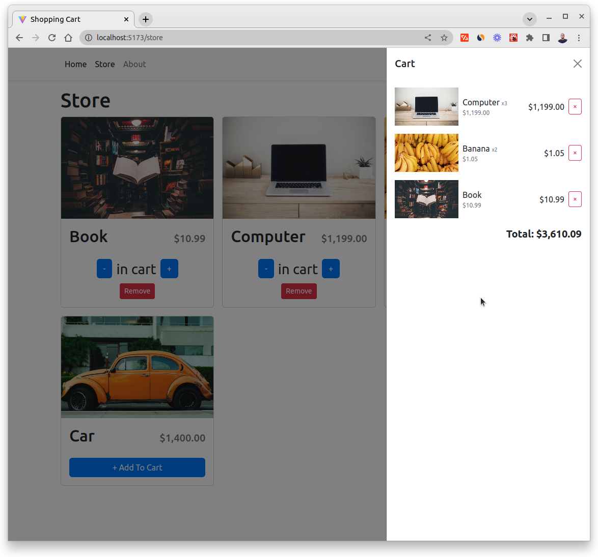
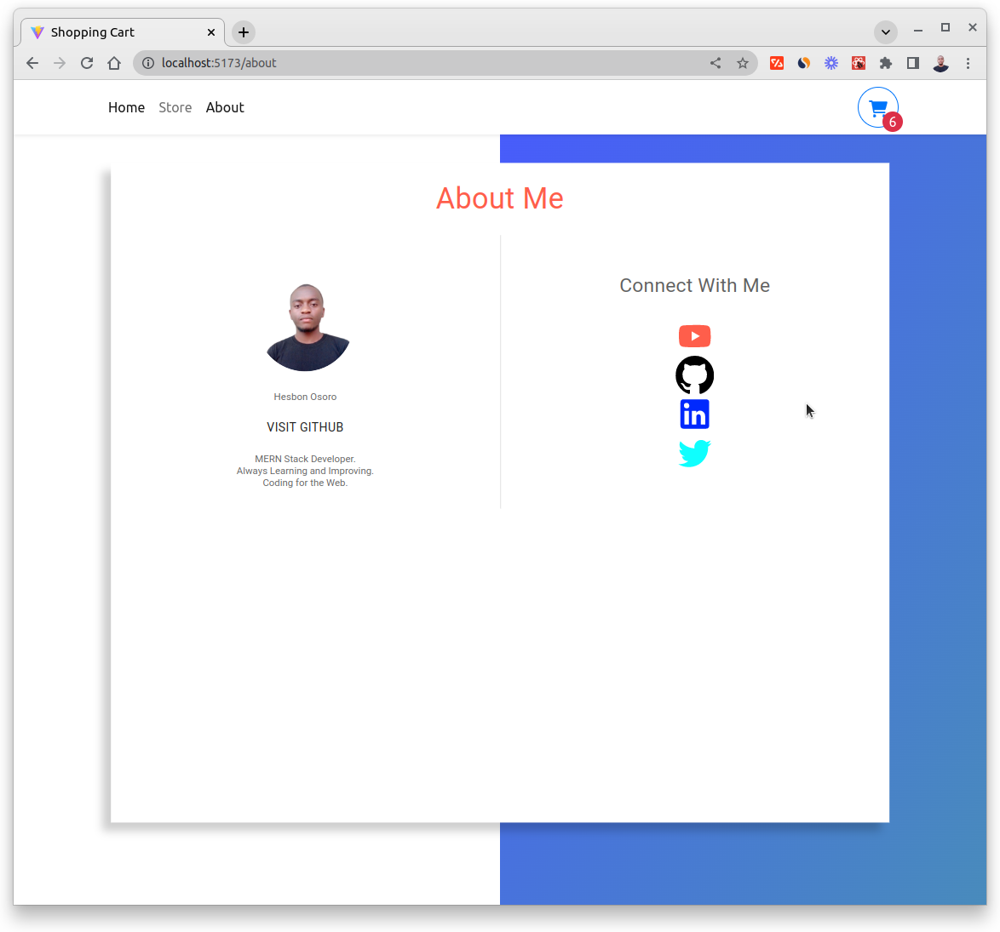

# Shopping Cart

[](https://reactts-shopping-cart.netlify.app/)

[](https://reactts-shopping-cart.netlify.app/)

[](https://reactts-shopping-cart.netlify.app/)

[](https://reactts-shopping-cart.netlify.app/)

A Shopping Cart in React and TypeScript

## Technologies

- React
- TypeScript
- Bootstrap
- React Router DOM
- React Context
- Vite
- Local Storage
- CSS
- HTML

# Project Setup

```code 
# Clone this repo
git clone https://github.com/hesbon-osoro/shopping-cart.git

# Navigate to directory and install packages
cd shopping-cart && yarn

# Start the app
yarn dev
```